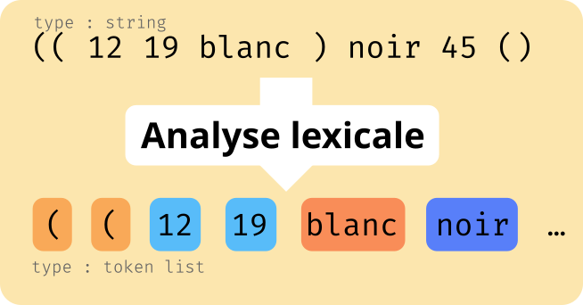

# PF - TP - 6.2

[📝 Sujet](https://ltpf.gricad-pages.univ-grenoble-alpes.fr/PF/Poly-TD.pdf)

On travaille avec cette grammaire :

```
P  := noir | blanc
C  := ( P int int )
Cl := ε | C Cl
S  := ( int int ) Cl
```

On a donc quatre non-terminaux (P, C, Cl et S) et cinq terminaux (`noir`, `blanc`, `(`, `)` et des nombres entiers, notés `int`).

## 1 — Types

> Définir un type `coup` permettant de représenter un coup d’une partie de Connect6, puis un type `partie` permettant de représenter une partie (dimensions du plateau incluses) telle que  celle du fichier donné en exemple

Un coup est caractérisé par un joueur et une position sur le plateau.

```ocaml
(* Avant de définir le type coup on définit le type joueur *)
type joueur = Blanc | Noir

type coup = joueur * int * int
```

Pour connaître le déroulé d'une partie on a besoin des dimensions du plateau, et d'une suite de coups.

```ocaml
type partie = int * int * coup list
```

## 2 — Analyse lexicale

Le but de l'analyse lexicale est de passer d'une chaîne de caractères à une suite de tokens (a.k.a terminaux). On ne se soucie pas du sens de ces mots, on veut juste les séparer les uns des autres (justement pour analyser leur sens plus facilement ensuite).



Pour ça, on va écrire des fonctions qui reconnaissent chaque token. Dans une version basique, ces fonctions prennent en entrée une chaîne de caractère et la renvoient éventuellement privée du token à reconnaître si il était au début.

```ocaml
let reconnaitre_noir : string -> string = …

(* Exemple d'utilisation *)

(* Si le token recherché n'est pas trouvé la chaîne
   est renvoyée à l'identique
*)
reconnaitre_noir "blanc 12" (* renvoie "blanc 12" *)

(* Si le token est trouvé, on renvoie la chaîne
   avec ce token en moins
*)
reconnaitre_noir "noir" (* renvoie "" *)

(* On en cherche le token qu'en début de chaîne  *)
reconnaitre_noir "blanc noir" (* renvoie "blanc noir" *)

(* On ne reconnaît le token qu'une seule fois *)
reconnaitre_noir "noir noir blanc" (* renvoie "noir blanc" *)
```

Les fonctions de ce format sont de type `analist = char list -> char list`. Pour facilement savoir si un token a été reconnu, on va faire en sorte que ces fonctions lèvent une exception si jamais rien n'est reconnu. On pourra alors faire

```ocaml
try
    let _ = reconnaitre_noir "…" in
    Printf.printf "C'est noir !"
with Echec ->
    Printf.printf "C'est PAS noir :("
```

On peut alors savoir si une chaîne ne contient que des tokens de notre grammaire en enchaînant les différents analyseurs.

```ocaml
let rec reconnaitre_tokens = fun chaine ->
    if chaine = "" then
        (* Si la chaîne est vide, l'analyse est finie,
           on renvoie un tuple vide pour que la fonction
           se termine
        *)
        ()
    else
        (* On essaie de reconnaître « noir » *)
        try
            let reste = reconnaitre_noir chaine in
            (* Si ça réussi, on analyse la suite de la chaîne *)
            reconnaitre_tokens reste
        (* Si ça rate, on tente de reconnaître un autre token *)
        with Echec ->
            try
                let reste = reconnaitre_blanc chaine in
                reconnaitre_tokens reste
            with Echec ->
                (* etc. *)
                (* Pour le dernier type de token, on ne
                  met pas de try/with pour laisser l'Echec
                  remonter (on est dans le cas où aucun token
                  n'est reconnu)
                *)
```

Si cette fonction renvoie `()` on sait que la chaîne est une suite de tokens valides. Si elle lève une exception, c'est qu'à un moment aucun token valide n'a pu être reconnu.

Il nous manque une dernière chose pour que ces fonction soient pratiques : on sait juste si on a une suite de tokens valides, mais pas quels sont ces tokens. On va donc passer de fonctions d'analyse de type `analist = char list -> char list` à des fonctions de type `'r ranalist = char list -> 'r * char list` qui renvoie à la fois la chaîne comme avant, mais aussi une information supplémentaire, d'un type quelconque. Ici on va spécialiser `'r` en `token` pour les fonctions qui reconnaissent un seul token, et en `token list` pour la fonction qui reconnaît la suite des tokens d'une chaîne de caractère.

```ocaml
(* Nouvelle version, qui renvoie la liste des tokens *)
let rec reconnaitre_tokens = fun chaine ->
    if chaine = "" then
        []
    else
        try
            let (token, reste) = reconnaitre_noir chaine in
            token :: (reconnaitre_tokens reste)
        with Echec ->
            try
                let (token, reste) = reconnaitre_blanc chaine in
                token :: (reconnaitre_tokens reste)
            with Echec ->
                (* … *)
```

Maintenant qu'on a l'idée générale, on peut répondre à la question.

> Écrire un type token approprié,

On écrit un type énuméré avec un constructeur pour chaque terminal de la grammaire.

```ocaml
type token =
  | ParenG (* parenthèse gauche *)
  | ParenD (* parenthèse droite *)
  | BlancT (* On doit les appeler BlancT / NoirT pour éviter les conflits avec les constructeurs du type joueur (T pour token) *)
  | NoirT
  | Int of int (* On ne va pas faire un constructeur par entier possible vu qu'il y en a UNE INFINITÉ et que ça fait beaucoup, donc on fait un constructeur avec un `int` en paramètre *)
```

> puis une fonction d’analyse lexicale pour chaque constructeur du type token,

```ocaml
(* le prof fourni des fonctions pour faire ça un
   peu plus vite sinon, mais là je réécris tout
   à la main pour bien comprendre ce qui se passe
*)

let reco_pareng = fun chaine ->
    match chaine with
    | '(' :: suite -> (ParenG, suite)
    | _ -> raise Echec

let reco_parend = fun chaine ->
    match chaine with
    | ')' :: suite -> (ParenD, suite)
    | _ -> raise Echec

let reco_noir = fun chaine ->
    match chaine with
    | 'n' :: 'o' :: 'i' :: 'r' :: suite -> (NoirT, suite)
    | _ -> raise Echec

let reco_blanc = fun chaine ->
    match chaine with
    | 'b' :: 'l' :: 'a' :: 'n' :: 'c' :: suite -> (BlancT, suite)
    | _ -> raise Echec

(* On considère qu'on a un analyseur lexical pour les entiers 
     parse_int : char list -> int * char list
   grâce à la question 6.1
*)

let reco_int = fun chaine ->
    let (i, reste) = parse_int chaine in
    Int i
```

> puis une fonction `token_here` qui rend le token en tête d’une liste de caractères.

```ocaml
let token_here = fun chaine ->
    try
        reco_pareng chaine
    with Echec -> try
        reco_parend chaine
    with Echec -> try
        reco_blanc chaine
    with Echec -> try
        reco_noir chaine
    with Echec ->
        let (i, reste) = parse_int chaine in
        (Int i, reste)
```

> Écrire ensuite une fonction espaces qui aspire rend une liste de caractères privées des caractères d’espacement en préfixe de cette liste,

```ocaml
let rec aspi_espace = fun chaine ->
    match chaine with
    | ' ' :: suite -> aspi_espace suite
    | _ -> chaine
```

> puis une fonction `next_token` qui rend le premier token d’une liste de caractères commençant éventuellement par des espaces.

```ocaml
let next_token = fun chaine ->
    token_here (aspi_espace chaine)
```

> Enfin, écrire une fonction tokens qui analyse une liste de caractères représentant une partie de Connect6 et qui retourne la liste de tokens correspondante.

```ocaml
let rec tokens_connect6 = fun chaine ->
    if chaine = [] then
        []
    else
        let (token, reste) = next_token chaine in
        token :: (tokens_connect6 reste)
```

> On pourra, au choix, utiliser les combinateurs d’analyseurs

L'écriture des fonctions au dessus peut être un peu longue et répétitive. Avec les combinateurs d'analyseurs (fichier `anacomb.ml`) on peut écrire :

```ocaml
let token_here =
    reco_pareng +|
    reco_parend +|
    reco_blanc  +|
    reco_noir   +|
    reco_int

let next_token = aspi_espace -+> token_here

let tokens_connect6 = star_list next_token
```

Ce qui est plus court et plus lisible.

## 3 — Analyse syntaxique

Le principe est le même, mais au lieu de passer d'une liste de caractères à une liste de tokens, on passe d'une liste de tokens à une `partie`. En combinant analyse lexicale puis analyse syntaxique, on pourra donc passer d'une liste de caractères à une `partie`.

```ocaml
(* Parseurs de terminaux *)

let lit_pareng = terminal ParenG
let lit_parend = terminal ParenG
let lit_noir = terminal ParenG
let lit_blanc = terminal ParenG
let lit_int = terminal ParenG

```